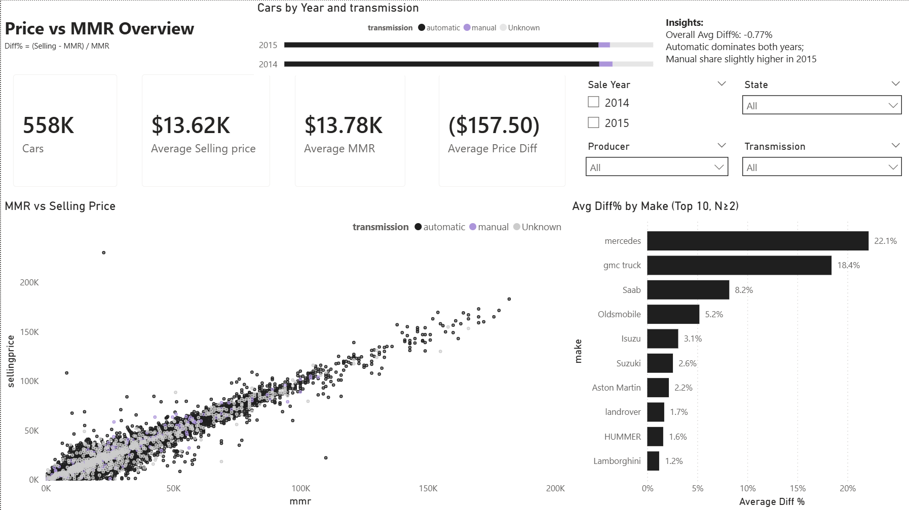
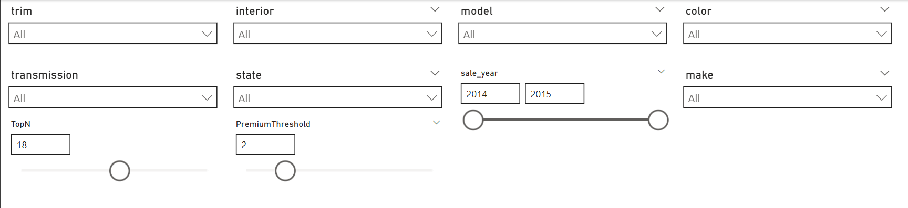
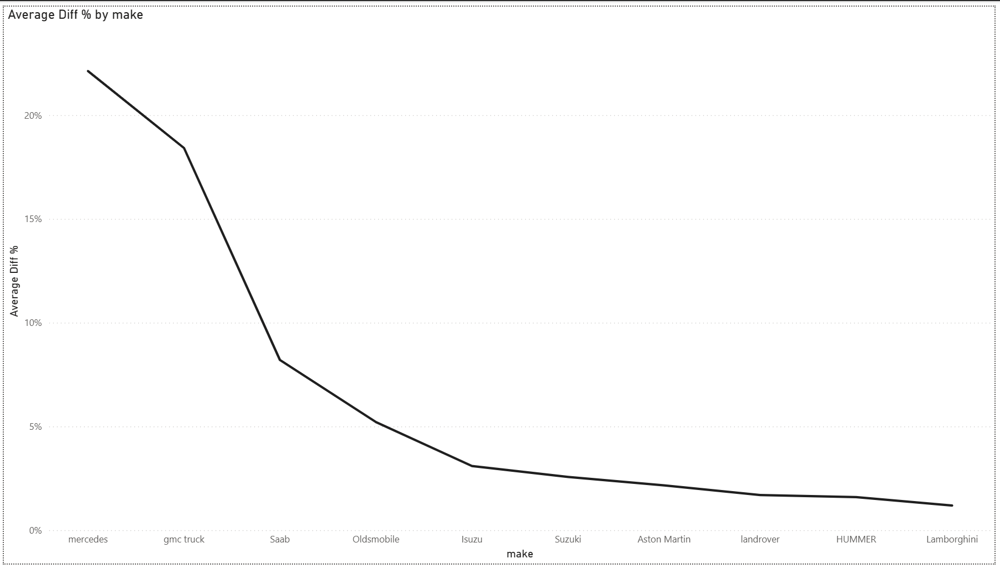
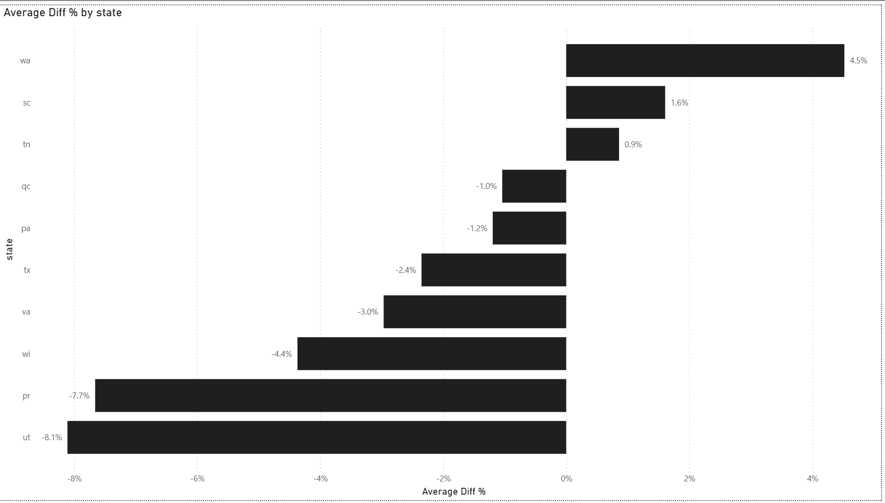
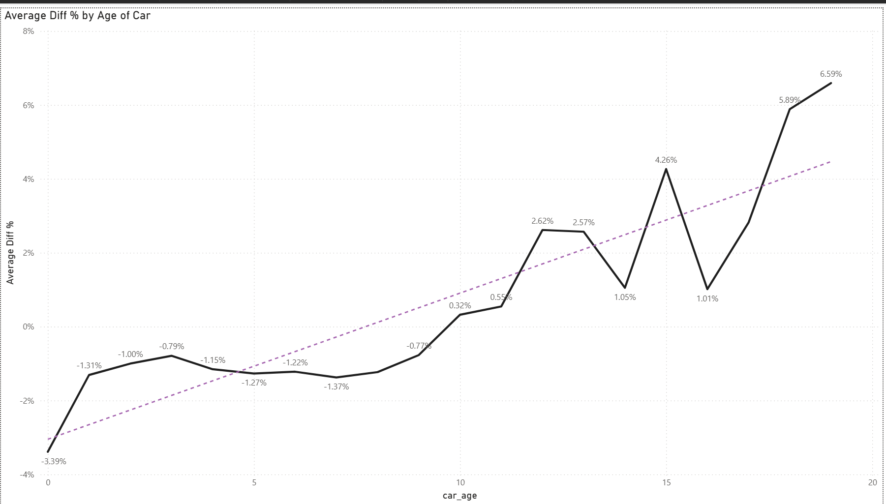
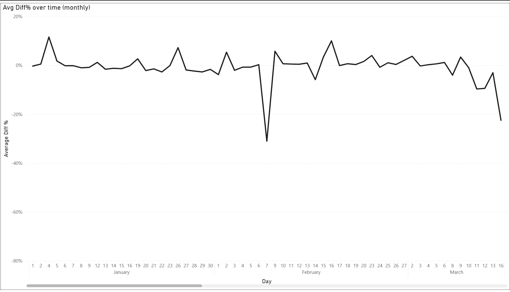

# Car Prices — Price vs MMR (Power BI + Python prep)

## Goal
Analyze how car selling prices deviate from MMR (market estimate) and build an interactive Power BI dashboard to explore:
- where cars sell above/below MMR
- differences by make, state, transmission, and sale year
- relationship between selling price and MMR

**Metric**
- `Diff% = (SellingPrice - MMR) / MMR`

## Dashboard Screenshots

### KPI Summary

### Filters (Slicers)

### Avg Diff % by Make (Top 10)

### Avg Diff % by State

### Avg Diff % by Car Age

### Avg Diff % over Time (Monthly)

## Key KPIs (Overall)
From the dashboard (All filters):
- Cars: **~558K**
- Average Selling Price: **$13.62K**
- Average MMR: **$13.78K**
- Average Price Diff: **-$157.50**
- Overall Avg Diff%: **-0.77%**

Interpretation:
- On average, cars are sold slightly **below** MMR (small negative deviation).

## Dataset
Source: `data/car_prices.csv`  
Prepared (for BI): `data/car_prices_clean.csv`

Main columns used:
- Car attributes: `year`, `make`, `model`, `trim`, `body`, `transmission`
- Location/seller: `state`, `seller`
- Condition: `condition`, `odometer`, `color`, `interior`
- Prices: `mmr`, `sellingprice`
- Time features: `sale_dt`, `sale_year`, `sale_month`, `car_age`
- Deviation metrics:
  - `price_diff = sellingprice - mmr`
  - `price_diff_pct = (sellingprice - mmr) / mmr`

## Power BI Report
File: `powerbi/Car_Sales.pbix`

### Main visuals
- **KPI cards**: Cars, Avg Selling Price, Avg MMR, Avg Price Diff
- **Cars by Year and Transmission** (composition by automatic/manual/unknown)
- **Scatter**: MMR vs Selling Price
- **Bar chart**: Avg Diff% by Make (Top 10)
- **Insight text** block summarizing overall deviation and transmission dominance

### Filters (Slicers)
- Sale Year (e.g., 2014 / 2015)
- State
- Producer (Make)
- Transmission

## Interactivity Features
- **Report tooltips**: custom tooltip page with KPIs shown on hover (applied to selected visuals)
- **Drill-through page**: details page for deeper analysis (e.g., by make/state), preserving selected filters

## How to Run
### Power BI
1) Open `powerbi/Car_Sales.pbix`
2) Refresh data:
   - If Power BI asks for a source path, point it to `data/car_prices_clean.csv`
3) Use slicers (Sale Year / State / Make / Transmission) to explore segments

### Python (optional prep)
Notebook (if included): `notebooks/03_car_prices_mmr.ipynb`
- Parses `saledate` into `sale_dt`
- Converts numeric columns
- Creates `price_diff` and `price_diff_pct`
- Exports `car_prices_clean.csv` for Power BI

## Repository Structure (recommended)
- data/
  - car_prices.csv
  - car_prices_clean.csv
- notebooks/
  - 03_car_prices_mmr.ipynb
- powerbi/
  - Car_Sales.pbix
- images/
  - car_sales_dashboard.png
  - (optional) tooltip.png
  - (optional) drillthrough_details.png
- README.md
